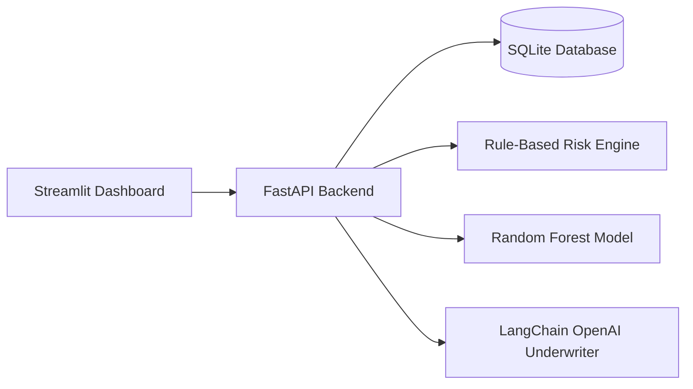

# Architecture Overview

```mermaid
flowchart LR
    UI[Streamlit Dashboard] --> API[FastAPI Backend]
    API --> DB[(SQLite Database)]
    API --> Rule[Rule-Based Risk Engine]
    API --> ML[Random Forest Model]
    API --> AI[LangChain OpenAI Underwriter]
```

The backend is structured around repositories, services, and models to keep business logic and persistence concerns separated.
